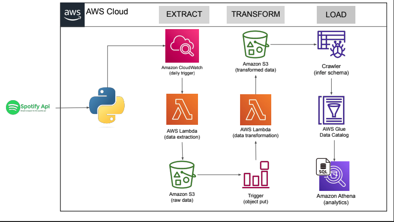

# Spotify Data Pipeline – Extract, Transform, and Analyze with AWS  
**Author:** Naveen Kumar Manokaran  

---

## ✨ Project Overview  
This project aims to build a **comprehensive data pipeline** for **extracting, transforming, and analyzing** Spotify data using AWS services. The pipeline integrates with the **Spotify API** to fetch relevant data, processes it using **AWS Lambda**, and stores it in an organized structure on **AWS S3**.  

The **extraction** process is automated via **AWS Lambda**, triggered at scheduled intervals through **Amazon CloudWatch**. The **transformation** phase includes cleaning and formatting data, storing processed results back in **Amazon S3** for further analysis. The transformed data is then **structured and queried** using **AWS Glue** and **Amazon Athena** to derive insights efficiently.  

This scalable and automated pipeline **simplifies data processing** and **enables efficient analytics** on Spotify data.  

---

## 📚 Reflection  

### **Key Steps:**  
1. **Extract Data** from the **Spotify API** using **AWS Lambda**, triggered by **Amazon CloudWatch**.  
2. **Store Raw Data** in **Amazon S3** for further processing.  
3. **Transform Data** via a second **AWS Lambda** function, which cleans, normalizes, and structures the data.  
4. **Monitor Changes** using **Amazon S3 event triggers** to initiate transformation.  
5. **Load Data into AWS Glue** via a **Crawler**, which infers the schema for further querying.  
6. **Analyze Data** using **Amazon Athena**, running SQL queries on the transformed dataset.  

---

## 🚀 Methodology  

### **1. Data Extraction**  
- **Goal:** Fetch data from **Spotify API** and store it in **Amazon S3**.  
- **Implementation:**  
  - **AWS Lambda** retrieves Spotify data and saves it to **Amazon S3**.  
  - **Amazon CloudWatch** schedules Lambda execution daily.  

### **2. Data Transformation**  
- **Goal:** Process and clean raw data before storage.  
- **Implementation:**  
  - **AWS Lambda** reads raw data from **Amazon S3**.  
  - Cleansing, normalizing, and filtering performed within Lambda.  
  - Transformed data stored in a separate **S3 bucket**.  

### **3. Data Loading & Analysis**  
- **Goal:** Enable structured querying for analytics.  
- **Implementation:**  
  - **AWS Glue Crawler** infers schema and creates a structured catalog.  
  - **AWS Glue Data Catalog** organizes data for querying.  
  - **Amazon Athena** runs SQL queries for analysis.  

---

## 📌 Architecture Diagram  

---

## 📝 Lessons Learned  

✅ **Automating Data Pipelines**: Used **AWS Lambda** and **Amazon CloudWatch** for serverless automation.  
✅ **Scalability**: Stored data efficiently in **Amazon S3** and queried it via **Amazon Athena**.  
✅ **Schema Inference**: Utilized **AWS Glue** to structure data dynamically.  
✅ **Event-Driven Processing**: Used **S3 triggers** to automate transformations.  
✅ **Cost Optimization**: Implemented **serverless architecture**, reducing infrastructure costs.  

---

## 📂 Output  

### **Key Observations**  
- Successfully fetched Spotify data and stored it in **Amazon S3**.  
- Transformed and structured data for efficient querying.  
- Enabled SQL-based analysis using **Amazon Athena**.  

### **Significance**  
- This pipeline offers a **scalable, automated, and cost-efficient** solution for processing **Spotify data**.  
- **Insights** from streaming data can support **recommendations, trend analysis, and music popularity metrics**.  

---

## 🛠️ Tools Used  

### **AWS Services and Their Roles**  

| **AWS Service**  | **Purpose** |
|------------------|------------|
| **Spotify API**  | Provides music streaming data for extraction. |
| **AWS Lambda**   | Executes data extraction and transformation functions without requiring servers. |
| **Amazon CloudWatch** | Schedules and monitors Lambda function execution. |
| **Amazon S3**    | Stores both raw and transformed data efficiently. |
| **Amazon S3 Triggers** | Automatically detects new data and triggers transformation functions. |
| **AWS Glue**     | Infers schema and creates a structured Data Catalog. |
| **AWS Glue Crawler** | Automates schema detection and data catalog updates. |
| **Amazon Athena** | Enables SQL-based analysis of transformed data. |

---

## 📂 How to Run  

### **1. Set Up AWS Environment**  
- Configure AWS Lambda and CloudWatch for scheduled data extraction.  
- Create Amazon S3 buckets for raw and transformed data.  

### **2. Deploy Extraction Process**  
- Write an AWS Lambda function to fetch **Spotify API data**.  
- Store extracted data in an **Amazon S3 bucket**.  

### **3. Implement Data Transformation**  
- Deploy a second AWS Lambda function to process raw data.  
- Store transformed data in another **S3 bucket**.  

### **4. Load Data into Glue & Athena**  
- Use **AWS Glue Crawler** to infer the data schema.  
- Query data using **Amazon Athena** for analysis.  

---

## 🔮 Future Enhancements  

- **Expand Data Sources:** Integrate with more APIs (e.g., YouTube, Apple Music).  
- **Real-Time Processing:** Use AWS Kinesis for **streaming** rather than batch processing.  
- **Visualization:** Connect **Athena** to **Amazon QuickSight** for dashboarding.  
- **Machine Learning:** Use AWS SageMaker to **predict music trends**.  

---

## 📜 References  

- **AWS Documentation:** [https://docs.aws.amazon.com](https://docs.aws.amazon.com)  
- **Spotify API Docs:** [https://developer.spotify.com](https://developer.spotify.com)  

---

